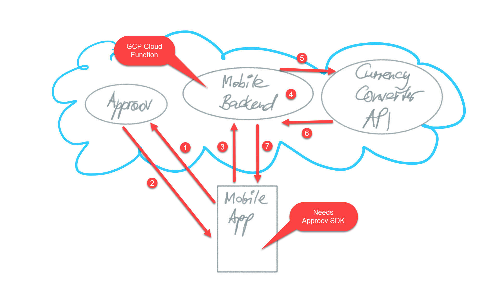

# flutter-with-approov

Demonstrates the usage of Approov 2.0 in a Flutter mobile app together with a GCP cloud function backend.

The Approov SDK provides security for mobile applications as described at <https://approov.io/docs/v2.0/>.

## Prerequisites

### Setup a Trial with the Approov API Protection Solution

For setting up a trial see <https://approov.io/>.

### Register APK with the Approov Service

The mobile app APK needs to have been registered with the Approov service.
Otherwise, the Approov service will not return valid tokens.

## Approov Message Flow Diagram

Eventually, the mobile app wants to make a call to the Currency Converter API which requires an API key.
However, in order to not expose this or any other API key in the mobile app the Approov mobile security framework is being used.

The message flow is the following:

1. Mobile app requests a token from Approov cloud service.
1. Approov will return a valid token if and only if it finds that the mobile app APK has been registered properly with the Approov service.
1. The mobile app sends a request to the mobile backend.
   It adds the previously received Approov token as a header.
1. The mobile backend checks the Approov token.
   1. Checks the token signature.
      It can do that because the mobile backend knows the Approov Secret that was used for signing.
      It knows it because it has been configured with an encrypted environment variable (using Google Cloud KMS) holding the Approov Secret.
   1. Checks that the token has not expired.
1. The mobile backend forwards the request to the Currency Converter API which in turn requires an API key.
That API key is added by the mobile backend.
It can do that because it has been configured with an encrypted environment variable (using Google Cloud KMS) holding the API key.
1. The Currency Converter API returns response.
1. The mobile backend forwards the response to the mobile app.
